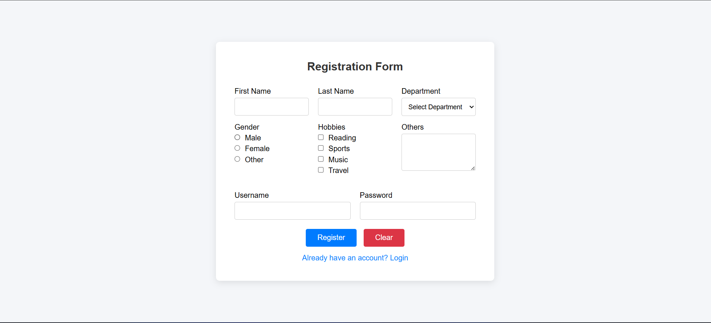
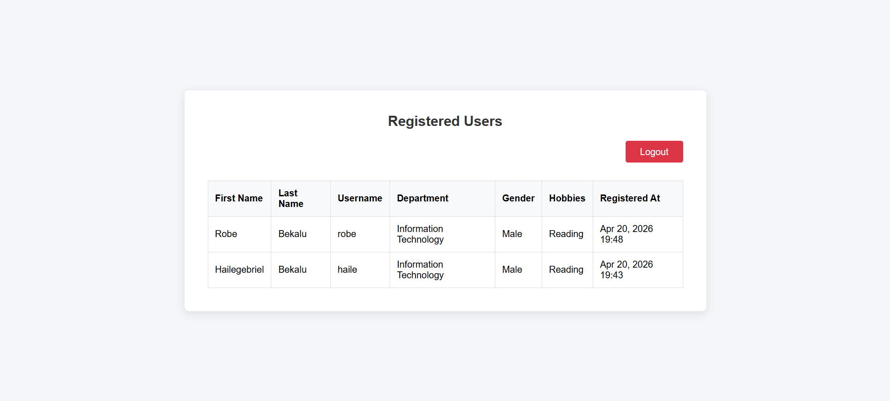

# PHP Registration and Login Class Project

A simple, complete, and clean class project demonstrating user registration, login authentication, and viewing registered users. It is built strictly with vanilla PHP, MySQL, HTML, and CSS.

## Screenshots

### Registration


### User List


## Features

- **User Registration**: A full registration form that accepts user details (First Name, Last Name, Department, Gender, Hobbies, Others) along with a Username and Password.
- **Secure Password Storage**: Uses `password_hash()` to safely encrypt passwords.
- **User Login**: Session-based authentication against the MySQL database.
- **Protected Area**: A cleanly formatted table that displays all registered users (accessible only to logged-in users).
- **Logout Functionality**: Cleanly destroys the session and ensures proper redirects.
- **Dockerized Environment**: The entire technology stack (PHP with Apache, MySQL) is containerized via Docker for immediate and straightforward setup.
- **Form Controls Check**: Includes both server-side validation and simple JavaScript controls (like resetting inputs via "Clear" buttons).

## Stack

- **Frontend**: HTML5, Vanilla CSS, Vanilla JS
- **Backend**: PHP 8.2
- **Database**: MySQL 8.0 (Using PDO for security against SQL injections)
- **Containerization**: Docker & Docker Compose

## Recommended Setup

This project uses Docker. This guarantees that no matter your operating system, everything will run flawlessly without requiring a manual installation of XAMPP/WAMP.

### Prerequisites

You must have [Docker](https://www.docker.com/products/docker-desktop/) installed and running.

### Installation

1. Open a terminal to this folder.
2. Run the application:
   ```bash
   docker-compose up --build -d
   ```
3. Open a browser and visit:  
   **[http://localhost:8080](http://localhost:8080)**

### First Run Considerations

On the very first run, Docker needs a moment to initialize the MySQL database and run `database/init.sql`. If you encounter a database connection error immediately after spinning it up, wait 5-10 seconds and refresh the page.

### Stopping the Servers

Once you are done working/testing, you can shut down the containers:
```bash
docker-compose down
```

## Directory Structure Overview

- `public/`: The only files exposed to the user browser. Containing scripts like login, registration, and user data.
- `app/`: Business logic, session handling (`Auth.php`), and utility functions.
- `config/`: System/infrastructure configurations, notably database connection setups.
- `database/`: Database files including the table schema (`init.sql`).
- `includes/`: Reused layout blocks like the navigation or page shell.
- `assets/`: Public files such as CSS styling and JS scripts.
